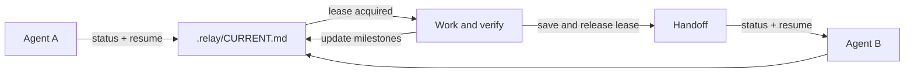

<h1 align="center">Project Continuity</h1>

<p align="center"><strong>One project. One current state. Any coding agent.</strong></p>

<p align="center">
  A local-first Agent Skill and CLI for reliable project progress across Codex, Claude Code, Kimi Code, ZCode, OpenCode, and other compatible agents.
</p>

<p align="center">
  <a href="README.md">English</a> · <a href="README.zh-CN.md">简体中文</a>
</p>

<p align="center">
  <a href="https://github.com/seriousz158/project-continuity/actions/workflows/ci.yml"></a>
  <a href="https://github.com/seriousz158/project-continuity/releases/latest"></a>
  <a href="LICENSE"></a>
  
  
</p>

---

`project-continuity` keeps the current project goal, tasks, blockers, evidence,
decisions, and exact next step in one reviewable file:

```text
.relay/CURRENT.md
```

The file contains authoritative structured JSON and a generated Markdown view.
Agents read the same state, writes use revision checks and a writer lease, and a
formal handoff releases that lease for the next agent. No chat replay, daemon,
database, cloud service, or model call is required.

## Why it exists

Coding agents are good at reading code, but chat history is not durable project
state:

- a new session may not know what was actually completed;
- prose notes can claim success without acceptance evidence;
- two agents can overwrite each other's updates;
- a finished task can be confused with merge, release, deployment, or an
  external experiment;
- multiple checkpoint files become competing sources of truth.

Project Continuity turns those failure modes into explicit protocol checks while
keeping the project state small enough for humans to review.

## What it maintains

```text
.relay/
├── CURRENT.md    # sole authority for current project progress after cutover
├── .gitignore    # keeps local runtime data local by default
├── history/      # immutable prior revisions
└── inbox/        # optional, unmerged agent input
```

Inside `CURRENT.md`:

| Record | Purpose |
| --- | --- |
| Project | Goal, lifecycle state, current task, exact next step, and separate outcome fields |
| Tasks | Stable IDs, owner, dependencies, acceptance conditions, and lifecycle status |
| Blockers | Open or resolved blockers with an explicit resolution |
| Evidence | Immutable checks tied to task acceptance and a captured code baseline |
| Decisions | Immutable conclusion, rationale, and related task IDs |
| Extensions | Namespaced project-specific current fields |

Task status is deliberately small: `todo`, `doing`, `blocked`, `done`, or
`cancelled`. A task cannot become `done` without current-generation passing
evidence for every acceptance condition.

## How it works



1. **Inspect** — `status` and `validate` are read-only and never initialize a
   project.
2. **Resume** — the agent reviews Git drift and acquires the writer lease using
   the observed revision.
3. **Update** — typed ID-based changes advance the revision while retaining the
   lease.
4. **Save** — the prior revision is archived, the new state is committed
   atomically, and the lease is released.
5. **Recover** — only an expired lease or supported history repair can enter the
   explicit recovery path.

## Quick start

Run the bundled script from a checkout or installed Skill directory.

```bash
# Explicit initialization is the only operation that creates .relay/
python scripts/write_current.py init --root /path/to/project --name "My Project"

# Read-only inspection
python scripts/write_current.py status --root /path/to/project
python scripts/write_current.py validate --root /path/to/project
```

Read the current revision, then acquire a lease and submit structured changes:

```bash
python scripts/write_current.py resume --root /path/to/project \
  --writer agent-a --expected-revision 0 --operation-id resume-001

python scripts/write_current.py update --root /path/to/project \
  --writer agent-a --expected-revision 1 --operation-id update-001 \
  --input examples/change.json

python scripts/write_current.py save --root /path/to/project \
  --writer agent-a --expected-revision 2 --operation-id save-001
```

Every successful mutation advances the revision. Re-read `status` before the
next write. An operation ID may be retried only with identical input. The
default lease lasts 30 minutes; `--allow-drift` is valid only after the reported
Git drift has been reviewed.

See the [command reference](references/commands.md) for migration, recovery,
custom lease duration, standard-input changes, and reviewed Git drift.

## Common workflows

| Situation | Recommended flow |
| --- | --- |
| Start a new project | Explicit `init`, then inspect the generated state |
| Begin or resume work | `status` → review Git drift → `resume` |
| Record task or blocker progress | `update` with typed changes by stable ID |
| Hand work to another agent | Record verified state with `save`; the lease is released |
| Continue in a fresh session | `status` → read next step and blockers → `resume` |
| Convert a v1 relay document | `migrate` dry run → review exact source hash → explicit apply |
| Repair after interruption | `status` + `validate` → `recover` only after lease expiry |

## Core guarantees

| Guarantee | Enforcement |
| --- | --- |
| One current-progress authority | One managed JSON block in `.relay/CURRENT.md`; Markdown is derived |
| No accidental initialization | Only explicit `init` creates relay state |
| No stale overwrite | Revision compare-and-swap on every mutation |
| One active submitter | Writer lease plus local OS file lock |
| Safe retries | Operation ID and input hash produce an idempotent receipt |
| Evidence-backed completion | Acceptance coverage and task generation are validated |
| Crash-safe commit | Prior-version snapshot, temporary file, sync, and atomic replacement |
| Git-aware resume | Branch, HEAD, index, tracked bytes, dirty and untracked state are distinguished |
| Conservative input handling | Path/link checks, 64 KiB document limit, and common-secret detection |

These protections coordinate cooperating local processes. They do **not** form a
distributed lock against another machine or a malicious process with equal OS
permissions.

## One authority, not one data warehouse

After explicit initialization of a new project, `CURRENT.md` is the sole
authority for **current project progress**. Existing projects keep their prior
business authority until field mapping and every active reader have been
reviewed and cut over.

Historical test reports, source code, experiment artifacts, release records,
and domain-specific evidence remain in their owning locations. Continuity
references them instead of copying everything into the relay file.

A task marked `done` never implies that code was merged, released, deployed, or
executed externally. Those outcomes are recorded separately.

## Migration

The built-in migration handles only the v1 relay format. It does not infer an
arbitrary project schema or rewrite project verifier logic.

```bash
# Preview: no writes
python scripts/write_current.py migrate --root /path/to/project

# Apply only after reviewing the preview and exact source hash
python scripts/write_current.py migrate --root /path/to/project --apply \
  --source-sha256 <hash-from-preview> \
  --writer agent-a --expected-revision <n> --operation-id migrate-001
```

Applied migration sets `mapping_review_required=true`. Keep it `UNVERIFIED`
until project-specific mapping and reader cutover are complete. Pause progress
edits during cutover and never dual-write the old and new authorities.

## Safety and scope

Project Continuity intentionally does not:

- capture or replay complete conversations;
- start a watcher, background scan, scheduler, or model;
- execute commands stored inside relay content;
- commit, push, merge, release, deploy, or run external experiments;
- silently take over an active writer;
- automatically resolve Git conflicts or choose the newest timestamp as truth;
- claim that best-effort secret detection is complete redaction.

Runtime data stays local by default. If a team explicitly chooses Git sharing,
share only `CURRENT.md` and the intentional ignore configuration—never the whole
`.relay/` directory. Review conflicts by stable record ID.

Git fingerprinting is bounded to 64 MiB of tracked worktree content and fails
closed on unsupported links, submodules, non-regular files, unmerged indexes,
or unavailable data. Repositories that rely on line-ending conversion or clean
filters may be conservatively reported as dirty.

## Compatibility

The Skill follows the open [`SKILL.md` Agent Skills
format](https://agentskills.io/specification). It is designed for Codex, Claude
Code, Kimi Code, ZCode, OpenCode, and other clients that can discover Agent
Skills or repository instructions. Discovery paths and reload behavior vary by
client, so installation, discovery, script invocation, and real cross-session
behavior must be verified separately.

The CLI supports macOS, Linux, and Windows on Python 3.11, 3.12, and 3.13.
GitHub Actions runs all nine OS/Python combinations.

## Installation

Download the complete archive from the [latest
release](https://github.com/seriousz158/project-continuity/releases/latest), or
clone the repository:

```bash
git clone https://github.com/seriousz158/project-continuity.git
cd project-continuity
python scripts/write_current.py --help
```

Copy the **complete** `project-continuity` directory to the Skill destination
used by your client; do not copy only `SKILL.md` or the entry script. If an
installation already exists, inspect and back it up before replacement. Reload
or restart a client only when it is safe, then verify discovery and run tests
from the installed directory.

## Verification

Version `v0.1.0` was released from a commit whose complete GitHub Actions matrix
passed. The source tree, a clean remote checkout, the built archive, and a
re-downloaded release archive each ran the same 52-test suite. A private,
isolated complex-project rehearsal preserved the full verifier result with zero
migration-added failures; it did not authorize a live project cutover.

```bash
python -m unittest discover -s tests -v
python scripts/package_skill.py /tmp/project-continuity-v0.1.0.zip
```

The deterministic packager includes only its 28-file allowlist and produces a
SHA-256 sidecar. It refuses to overwrite an existing archive or checksum.

## Documentation

- [Command reference](references/commands.md)
- [Protocol and data model](references/protocol.md)
- [Chinese README](README.zh-CN.md)
- [Changelog](CHANGELOG.md)
- [Security policy](SECURITY.md)
- [Contributing](CONTRIBUTING.md)

## Project status

- Latest stable release: [`v0.1.0`](https://github.com/seriousz158/project-continuity/releases/tag/v0.1.0)
- Runtime dependencies: Python standard library only
- Default mode: local, explicit, no background service
- License: [MIT](LICENSE)

Copyright (c) 2026 seriousz158. [NOTICE](NOTICE) preserves applicable attribution
for portions influenced by `liu676767/codex-project-checkpoint-memory`.
