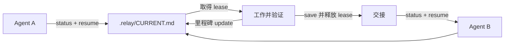

<h1 align="center">Project Continuity</h1>

<p align="center"><strong>一个项目，一份当前状态，跨 Agent 连续工作。</strong></p>

<p align="center">
  面向 Codex、Claude Code、Kimi Code、ZCode、OpenCode 及其他兼容客户端的本地优先项目进度 Skill 与 CLI。
</p>

<p align="center">
  <a href="README.md">English</a> · <a href="README.zh-CN.md">简体中文</a>
</p>

<p align="center">
  <a href="https://github.com/seriousz158/project-continuity/actions/workflows/ci.yml"></a>
  <a href="https://github.com/seriousz158/project-continuity/releases/latest"></a>
  <a href="LICENSE"></a>
  
  
</p>

---

`project-continuity` 把当前目标、任务、阻塞、证据、决策和精确下一步放进一份可审查文件：

```text
.relay/CURRENT.md
```

文件内部由权威的结构化 JSON 和自动生成的 Markdown 视图组成。所有 Agent 读取同一状态；写入经过 revision 校验和 writer lease；正式交接会释放 lease，让下一位 Agent 安全接棒。接力文件接近 64 KiB 上限时，CLI 会在同一锁内无损归档旧操作回执，不会截断项目记录。整个流程不依赖聊天回放、后台服务、数据库、云服务或模型调用。

## 为什么需要它

编码 Agent 能读代码，但聊天记录不是可靠的项目状态：

- 新会话不知道上一次真正完成了什么；
- 普通进度文字可能在没有验收证据时宣称完成；
- 两个 Agent 可能互相覆盖更新；
- 任务完成容易被误解成已经合并、发布、部署或执行实验；
- 多份 checkpoint 会逐渐变成互相竞争的真相源。

Project Continuity 把这些风险变成明确的协议校验，同时保持状态足够小，让人可以直接审查。

## 它维护什么

```text
.relay/
├── CURRENT.md    # 完成切换后，当前项目进度的唯一权威
├── .gitignore    # 默认让运行态保留在本地
├── history/      # 不可覆盖的历史 revision
├── receipts/     # v3 内容寻址的回执片段，默认只在本地
└── inbox/        # 可选、尚未合并的 Agent 输入
```

`CURRENT.md` 中的结构化对象：

| 对象 | 用途 |
| --- | --- |
| 项目 | 目标、运行状态、当前任务、精确下一步，以及独立的结果字段 |
| 任务 | 稳定 ID、负责人、依赖、验收条件和生命周期状态 |
| 阻塞 | open/resolved 状态，以及明确的解除说明 |
| 证据 | 不可修改的检查记录，关联任务验收和代码基线 |
| 决策 | 不可修改的结论、理由和关联任务 |
| 扩展 | 命名空间隔离的项目专属当前字段 |

任务状态固定为 `todo`、`doing`、`blocked`、`done` 或 `cancelled`。没有覆盖当前 generation 全部验收条件的通过证据，任务不能变成 `done`。

## 工作方式



1. **检查**：`status` 与 `validate` 完全只读，不会隐式初始化项目。
2. **接棒**：Agent 核对 Git 漂移，并使用实际 revision 取得 writer lease。
3. **更新**：按稳定 ID 提交结构化变更，revision 增加但 lease 保留。
4. **保存**：先归档旧 revision，再原子提交新状态并释放 lease。容量治理在同一锁内完成后才替换当前文件。
5. **恢复**：只有 lease 已过期或存在受支持的历史修复场景，才允许显式 `recover`。

## 快速开始

在源码目录或完整安装的 Skill 目录中运行脚本：

```bash
# 只有显式 init 才会创建 .relay/
python scripts/write_current.py init --root /path/to/project --name "My Project"

# 只读检查
python scripts/write_current.py status --root /path/to/project
python scripts/write_current.py validate --root /path/to/project
```

读取当前 revision，然后取得 lease 并提交结构化变更：

```bash
python scripts/write_current.py resume --root /path/to/project \
  --writer agent-a --expected-revision 0 --operation-id resume-001

python scripts/write_current.py update --root /path/to/project \
  --writer agent-a --expected-revision 1 --operation-id update-001 \
  --input examples/change.json

python scripts/write_current.py save --root /path/to/project \
  --writer agent-a --expected-revision 2 --operation-id save-001
```

每次成功写入都会增加 revision。下一次写入前重新读取 `status`。同一个 operation ID 只能在输入完全相同时安全重试。默认 lease 为 30 分钟；只有审查过报告的 Git 漂移后才能使用 `--allow-drift`。

容量会自动治理：达到 64 KiB 的 80% 时，最新 32 条回执保留在当前文件，其余回执无损写入 `.relay/receipts/`，前提是已显式迁移为 v3。可以先预览或显式执行：

```bash
python scripts/write_current.py compact --root /path/to/project
python scripts/write_current.py compact --apply --root /path/to/project \
  --writer agent-a --expected-revision 3 --operation-id compact-001
```

不带 `--apply` 的 `compact` 完全只读。`resume`、`update` 和 `save` 支持单次 `--no-auto-compact`，但不会绕过硬上限。

如需明确地跨客户端传递，可导出并校验受控交接包；history、inbox、锁和备份仍保留在本地：

```bash
python scripts/write_current.py export --root /path/to/project \
  --output /tmp/project-continuity-handoff.zip
python scripts/write_current.py verify --bundle /tmp/project-continuity-handoff.zip
```

迁移、恢复、自定义 lease、标准输入、容量预览和回执压缩见[命令参考](references/commands.md)。

## 常用工作流

| 场景 | 推荐流程 |
| --- | --- |
| 新项目启用接力 | 显式 `init`，然后检查生成的状态 |
| 开始或恢复任务 | `status` → 核对 Git 漂移 → `resume` |
| 记录任务或阻塞变化 | 使用稳定 ID 执行结构化 `update` |
| 交给另一个 Agent | 用 `save` 记录已验证状态并释放 lease |
| 新会话继续 | `status` → 读取下一步和阻塞 → `resume` |
| 转换 v1 relay | `migrate` dry-run → 审查源哈希 → 显式 apply |
| 启用回执 v3 | `migrate --to-v3` dry-run → 审查源哈希 → 显式 apply（自动治理前必须显式迁移） |
| 中断后修复 | `status` + `validate` → lease 过期后才 `recover` |

## 核心保证

| 保证 | 实现方式 |
| --- | --- |
| 当前进度只有一个权威 | `.relay/CURRENT.md` 中只有一个受控 JSON 区；Markdown 只是派生视图 |
| 不会意外初始化 | 只有显式 `init` 才创建 relay 状态 |
| 陈旧写入不能覆盖新状态 | 每次写入执行 revision compare-and-swap |
| 同时只有一个提交者 | writer lease 加本机操作系统文件锁 |
| 重试安全 | operation ID 与输入哈希形成幂等回执 |
| 完成必须有证据 | 校验验收覆盖和任务 generation |
| 崩溃安全提交 | 旧版本快照、临时文件、同步和原子替换 |
| 协议增长有界 | 达到 80% 容量时保留最新 32 条回执，其余完整写入内容寻址归档链 |
| 接棒时识别 Git 漂移 | 分开识别 branch、HEAD、index、tracked bytes、dirty 与 untracked |
| 保守处理输入 | 路径/链接检查、64 KiB 上限和常见秘密扫描 |

这些保护只协调共享同一本地目录的合作进程，不是跨机器分布式锁，也不声称能够对抗具有同等操作系统权限的恶意进程。

## 一个权威，不是一个数据仓库

新项目显式初始化后，`CURRENT.md` 是**当前项目进度**的唯一权威。既有项目在完成字段映射和全部活动读取方切换前，继续保留原业务权威。

历史测试报告、源码、实验产物、发布记录和领域证据继续保存在各自位置。接力文件引用这些证据，而不是复制和吞并所有项目数据。

任务标记为 `done` 不代表已经 merge、release、deploy 或执行外部实验；这些结果必须独立记录。

## 迁移

内置迁移只处理 v1 relay 格式，不会推断任意业务 schema，也不会改写项目 verifier。

```bash
# 预览：零写入
python scripts/write_current.py migrate --root /path/to/project

# 审查预览和精确源哈希后才 apply
python scripts/write_current.py migrate --root /path/to/project --apply \
  --source-sha256 <hash-from-preview> \
  --writer agent-a --expected-revision <n> --operation-id migrate-001
```

Apply 后会设置 `mapping_review_required=true`。项目专属字段映射和读取方切换完成前，状态必须保持 `UNVERIFIED`。切换期间暂停进度写入，禁止同时双写旧权威和新权威。

## 安全边界

Project Continuity 明确不会：

- 捕获或回放完整聊天；
- 启动 watcher、后台扫描、定时任务或模型；
- 执行接力内容中出现的命令；
- 自动 commit、push、merge、release、deploy 或运行外部实验；
- 静默抢占仍然有效的 writer；
- 自动解决 Git 冲突，或简单按更新时间选择真相；
- 把防误写秘密扫描宣传成完整脱敏系统。

运行态默认保存在本地。团队明确选择 Git 共享时，只共享 `CURRENT.md` 和有意设置的 ignore 配置，绝不共享整个 `.relay/`。冲突必须按稳定记录 ID 审查。

Git 指纹最多读取 64 MiB tracked 工作区内容；遇到不支持的链接、submodule、非普通文件、未合并 index 或不可用数据时会失败关闭。依赖换行转换或 clean filter 的仓库可能被保守地报告为 dirty。

## 兼容性

Skill 遵循开放的 [`SKILL.md` Agent Skills 规范](https://agentskills.io/specification)，面向 Codex、Claude Code、Kimi Code、ZCode、OpenCode 以及其他能够发现 Agent Skills 或仓库指令的客户端。不同客户端的发现路径和重新加载行为不同，因此格式校验、客户端发现、脚本调用和真实跨会话行为必须分层验证。

CLI 支持 macOS、Linux、Windows，以及 Python 3.11、3.12、3.13。GitHub Actions 会运行全部九种 OS/Python 组合。

## 安装

从[最新 Release](https://github.com/seriousz158/project-continuity/releases/latest)下载完整压缩包，或克隆仓库：

```bash
git clone https://github.com/seriousz158/project-continuity.git
cd project-continuity
python scripts/write_current.py --help
```

将**完整的** `project-continuity` 目录复制到客户端实际使用的 Skill 目录；不要只复制 `SKILL.md` 或入口脚本。若已存在旧安装，先检查并完整备份，再决定是否替换。仅在安全时重载或重启客户端，随后分别验证 Skill 发现，并从安装目录运行测试。

## 验证情况

工作区已实现带回执容量治理的 `v0.2.0-rc.1` 候选功能，但尚未宣称正式发布。正式发布前必须通过完整 GitHub Actions 矩阵、远端干净克隆、发行压缩包和重新下载的压缩包验证。`v0.1.0` 的私有隔离复杂项目演练仍只是迁移证据；该结果没有授权真实项目切换。

```bash
python -m unittest discover -s tests -v
python scripts/package_skill.py /tmp/project-continuity-v0.2.0-rc.1.zip
```

确定性打包器只包含 allowlist 文件，同时生成 SHA-256 sidecar；如果压缩包或校验文件已存在，它会拒绝覆盖。

## 文档

- [命令参考](references/commands.md)
- [协议与数据模型](references/protocol.md)
- [English README](README.md)
- [变更日志](CHANGELOG.md)
- [安全策略](SECURITY.md)
- [贡献指南](CONTRIBUTING.md)

## 项目状态

- 最新稳定版本：[`v0.1.1`](https://github.com/seriousz158/project-continuity/releases/tag/v0.1.1)
- 下一候选版本：`v0.2.0-rc.1`（自动回执容量治理，尚未发布）
- 运行依赖：仅 Python 标准库
- 默认模式：本地、显式、没有后台服务
- 许可证：[MIT](LICENSE)

Copyright (c) 2026 seriousz158。[NOTICE](NOTICE) 保留了受 `liu676767/codex-project-checkpoint-memory` 影响部分的适用署名。
